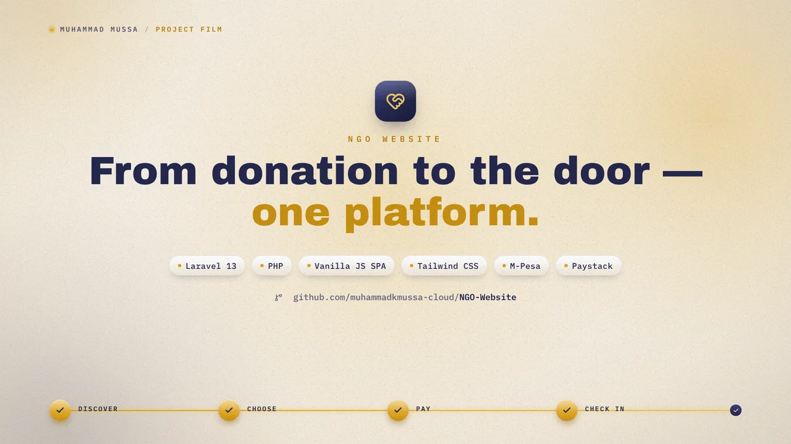

# Reaching Out Initiative (ROI) - Digital Platform

https://github.com/user-attachments/assets/0329efd8-90ca-4a1c-b6f0-41320b3913df

[](https://GitHub.com/user-attachments/assets/0329efd8-90ca-4a1c-b6f0-41320b3913df)

**Production Turnover & Architecture Report**

* **Organization:** Reaching Out Initiative (ROI)
* **Location:** Mombasa, Kenya (Coastal Headquarters)
* **Flagship Asset:** *Vijana Na Maadili* Annual Youth Empowerment Conference
* **Version:** 2.1.0 — Laravel Edition (2026)

---

## 1. Executive Summary

The full-stack digital ecosystem for the **Reaching Out Initiative (ROI)** runs on a dependency-light, single-server architecture:

* **Frontend:** Vanilla HTML/CSS/JS SPA — no framework runtime. Hash-based routing (`#/path`), Tailwind CSS compiled via CLI, hand-rolled resilient API layer (offline demo-fallback engine + strict production mode).
* **Backend:** Laravel 13 (PHP 8.2+) REST API — Eloquent ORM, JWT bearer auth (HS256), rate-limited password-only single-admin design.
* **Database:** SQLite (dev) / PostgreSQL (Supabase-ready via `supabase_schema.sql` or Laravel migrations).
* **Payments:** Paystack (init/verify/HMAC-SHA512 webhooks) + Safaricom Daraja M-Pesa STK Push with hardened webhook token.
* **Media Engine:** YouTube Data API v3 sync service with local relational caching, quota-guard placeholder detection, and Laravel scheduler (`roi:youtube-sync` every 6 h) replacing Vercel Cron.
* **Hosting:** Single VPS / shared hosting — Laravel serves both the API (`/api/*`) and the compiled SPA (`/`) from one origin. No CORS required in production.

---

## 2. Quickstart

### 2.1 One-Click Launch
* **Mac / Linux:** `./start.sh`
* **Windows:** `start.bat`

This installs dependencies, runs migrations + seeder, starts the Laravel API on `:8000`, builds the SPA, and serves it on `:3000`.
**Single-origin mode:** the build also deploys the SPA into `laravel-backend/public/`, so simply opening `http://127.0.0.1:8000/` serves the whole platform from one origin.

### 2.2 Manual Commands

```bash
# Backend
cd laravel-backend
composer install
cp .env.example .env          # then fill in secrets
php artisan key:generate
touch database/database.sqlite
php artisan migrate --seed

php artisan serve --port=8000

# Frontend
cd frontend
npm install
npm run build                 # Tailwind CLI + module assembly → dist/ (+ laravel-backend/public/)
npm run dev                   # static preview on :3000
```

### 2.3 Docker

```bash
docker compose up --build
# API: http://localhost:8000 · SPA preview: http://localhost:3000
```

### 2.4 Admin credentials

| Field | Configuration |
|---|---|
| Email | `ADMIN_EMAIL` (deployment template: `admin@example.com`) |
| Password | A unique 16+ character password; only its bcrypt/Argon hash is stored in `ADMIN_PASSWORD_HASH` |

The admin console is reachable via the footer link **Singular Admin Console**, or the secret header **logo 5-clicks-in-3-seconds** easter egg. Generate a hash safely with `php artisan roi:hash-admin-password`, place it in the environment's encrypted secret store, rotate `JWT_SECRET_KEY`, clear cached configuration, and run `php artisan roi:sync-admin`. No production password or hash belongs in Git.

---

## 3. Architecture

```text
ROI_web/
├── laravel-backend/               # Laravel 13 REST API
│   ├── app/
│   │   ├── Http/
│   │   │   ├── Controllers/       # Auth, Public, Admin, Payment, Media controllers
│   │   │   └── Middleware/        # AdminAuth (JWT bearer guard)
│   │   ├── Models/                # 9 Eloquent models + ApiSerializable concern
│   │   └── Services/              # Jwt, Password, Audit, Paystack, Mpesa, YouTubeSync
│   ├── bootstrap/app.php          # {detail:"..."} error parity, 120/min throttle
│   ├── config/roi.php             # All ROI env settings
│   ├── database/
│   │   ├── migrations/            # 9 tables (mirrors legacy SQLAlchemy schema)
│   │   └── seeders/RoiSeeder.php  # Idempotent demo content (events, blogs, media, ...)
│   ├── routes/api.php             # Full endpoint surface (unchanged paths)
│   └── Dockerfile
├── frontend/                      # Vanilla SPA (no framework runtime)
│   ├── index.html                 # Shell (Inter fonts, favicon, runtime config)
│   ├── src/css/app.css            # Tailwind entry + custom utilities/keyframes
│   ├── src/js/
│   │   ├── main.js router.js api.js storage.js store.js ui.js icons.js
│   │   ├── data/fallbackData.js   # Offline demo dataset (verbatim legacy port)
│   │   ├── components/            # header, footer, donationModal, videoLightbox
│   │   └── pages/                 # home, about, events, blog, mediaHub,
│   │                              # contact, volunteer, adminLogin, adminDashboard
│   ├── scripts/build.mjs          # Assembles dist/ + deploys into Laravel public/
│   └── tailwind.config.js
├── supabase_schema.sql            # Postgres DDL (still valid for Supabase)
├── docker-compose.yml
├── start.sh / start.bat
└── .env.example
```

---

## 4. API Endpoint Surface (unchanged from v2.0)

All routes are prefixed `/api` and render FastAPI-compatible errors (`{"detail": "..."}`).

| Domain | Endpoints |
|---|---|
| Health | `GET /api/health`, `GET /api/ready` (rate-limit exempt; production health omits engine internals) |
| Auth | `POST /api/auth/login`, `POST /api/auth/logout` |
| Public | `GET /public/blog[/{slug}]`, `/public/events`, `/public/media[/latest|/refresh]`, `/public/metrics`, `/public/leaders`, `/public/solutions[/{slug}]`, `POST /public/solutions/inquire`, `GET /public/portfolio[/{slug}]`, `POST /public/volunteer`, `POST /public/contact` |
| Payments | `POST /payments/checkout`, `GET /payments/verify/{ref}`, `POST /payments/webhook/mpesa` *(token-hardened)*, `POST /payments/webhook/paystack`, `GET /payments/paybills` |
| YouTube | `POST /youtube/cron-sync`, `GET /youtube/channel-videos` |
| Ticketing | `GET /public/events/{id}/tickets`, `POST /tickets/checkout`, `POST /tickets/recover`, `POST /tickets/lookup-order`, `GET /tickets/portal/{token}`, `GET /tickets/orders/{ref}[/verify|/pass]`, `POST /tickets/orders/{ref}/stk-retry`, `POST /tickets/orders/{ref}/resend`, `GET /tickets/lookup/{code}` |
| Admin (JWT) | `GET /admin/stats`, `/admin/audit-logs`, `/admin/volunteers[/export]`, `/admin/inquiries`, `PUT /admin/inquiries/{id}/read`, `POST /admin/media/sync`, CRUD: `/admin/blog`, `/admin/events`, `/admin/leaders`, `/admin/ticket-types`, `GET /admin/ticket-stats`, `GET /admin/ticket-orders[/export]`, `GET /admin/tickets/{code}`, `POST /admin/tickets/{code}/check-in`, `POST /admin/tickets/{code}/undo-check-in` |

### 4.1 Behavioral Parity Notes
* Login now uses the fixed admin email plus password only. Rejections stay generic, successful configured-password logins upgrade/sync the stored hash, and password-guessing is capped by both route throttling and account/IP failure counters.
* Dashboard FX display math preserved (USD×130, EUR×140, GBP×165; KES floor 254,500).
* Vanity metrics floors preserved (120/24/95/45).
* Dev/test sandbox payment stubs preserved (`checkout.paystack.com/verified-sandbox-*`, `ws_CO_SIM_*`).
* Rate limiting is 120 req/min/IP (Laravel fixed window vs legacy sliding window — documented deviation).
* Blog slug uniqueness is now also enforced on update (legacy 500-risk removed).

### 4.2 Security Hardening (intentional deviations)
1. Admin login is password-only, rate-limited, audited, and production-hardened against demo or legacy SHA-256 password hashes.
2. M-Pesa webhook verifies a shared `MPESA_WEBHOOK_TOKEN` when configured and never mutates unknown references.
3. Paystack webhook HMAC-SHA512 is enforced whenever `PAYSTACK_SECRET_KEY` is set (dev bypass only with no secret configured).

---

## 5. Frontend Resilience Engine

`frontend/src/js/api.js` preserves the dual-mode behavior:

* **Live production** (`window.ROI_STRICT_API_MODE = true`): any backend failure throws immediately.
* **Offline preview** (default): failures dispatch `roi_api_fallback_triggered`, render the amber transparency banner with **Retry Connection**, and serve the static demo dataset from `data/fallbackData.js`.

Runtime configuration (replaces Vite env vars) lives in `frontend/index.html`:

```js
window.ROI_API_BASE_URL = '/api';        // override for split deployments
window.ROI_STRICT_API_MODE = true;       // enforce strict outage errors
```

---

## 6. Deployment (cPanel / shared hosting)

The production target requires PHP 8.3+, Composer, MySQL, and the PHP extensions listed by `deployment/cpanel/preflight.sh`. Build the SPA locally, keep the Laravel application and `.env` outside the public document root, and expose only `laravel-backend/public/`.

For the recoverable WordPress-to-Laravel replacement workflow, release builder, server preflight, backup verification, empty-database migration, cutover, and rollback instructions, use [`deployment/cpanel/README.md`](deployment/cpanel/README.md).

Run Laravel's scheduler every minute; the application itself dispatches YouTube synchronization every six hours:

```cron
* * * * * /path/to/php /absolute/path/to/artisan schedule:run >> /dev/null 2>&1
```

---

## 7. Testing

The Laravel feature suite (44 tests / 199 assertions) ports the legacy `test_all_backend_functions.py` acceptance script:

```bash
cd laravel-backend
php artisan migrate
php artisan test --filter=Ticket
php artisan test --filter=Digital
php artisan test --filter=ProductionHardening
php artisan test

# Frontend helpers
cd ../frontend
npm test
npm run test:responsive
```

Covers: health/readiness, password-only auth flow, public content endpoints, admin CRUD + CSV export, payment sandbox checkout/verify, both webhooks (including hardened token/signature rejection), YouTube quota-guard, ISO-8601 duration parsing, ticketing, digital solutions, production hardening (request ids, HSTS, webhook fail-closed, e2e checkout), and responsive frontend smoke coverage for Donate/header/modal behavior across phone, tablet, small-laptop, and desktop-nav breakpoints.

---

## 8. Verified Production Contact Reference

* **Primary Gmail Desk:** `reachingoutinitiative2021@gmail.com`
* **Primary Telephone Lines:** `+254 745 273 556` or `+254 734 292 124`
* **Facebook:** `https://www.facebook.com/share/1D2APpFpRf/`
* **Instagram:** `https://www.instagram.com/reachingoutinitiative.ke`
* **YouTube:** `https://youtube.com/@reachingoutinitiativemedia`
* **TikTok:** `https://www.tiktok.com/@reachingoutinitiative.ke`
* **Registration:** CBO/MSA/2021/8841
* **Legal Compliance Timestamp:** `© 2026 Reaching Out Initiative. All Rights Reserved.`

